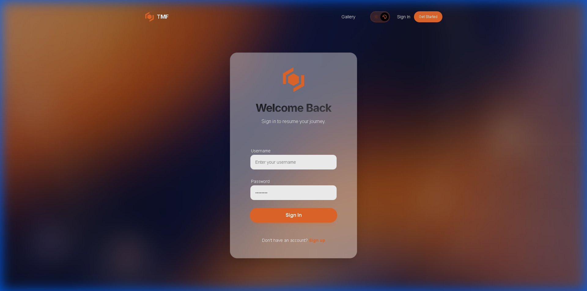
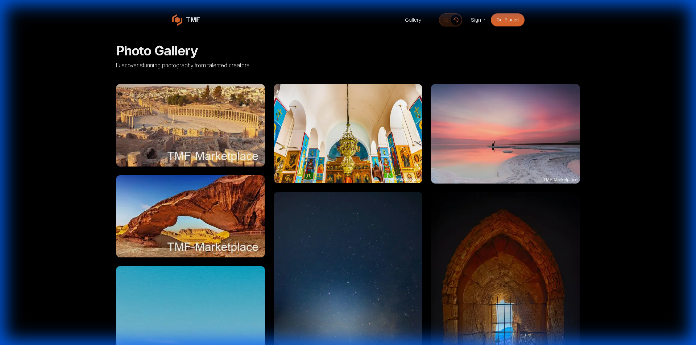

# TMF Marketplace Frontend 

The modern, high-performance frontend for **TMF Marketplace**. Built with **Next.js 16**, **Tailwind CSS**, and **Framer Motion**.

##  Features
-   **Modern UX**: Glassmorphism, Smooth Scroll (Lenis), Parallax effects.
-   **Animations**: Advanced interactions using Framer Motion.
-   **Gallery**: Fullscreen lightbox with zoom/pan capabilities.
-   **Dashboard**: Secure upload area with drag-and-drop.
-   **Auth**: JWT-based authentication flow.

## 📸 Screenshots

| Home Page | Login Page |
|:---:|:---:|
|  |  |

| Gallery Page |
|:---:|
|  |

##  Tech Stack
-   **Framework**: Next.js 16 (App Router)
-   **Styling**: Tailwind CSS
-   **Animation**: Framer Motion
-   **State**: React Context (Auth, Toast)
-   **Language**: TypeScript

##  Quick Start

### Prerequisites
-   Node.js 18+
-   Backend API running (locally or remote)

### 1. Clone & Install
```bash
git clone https://github.com/alaa-talab/tmf_marketplace_frontend.git
cd tmf_marketplace_frontend
npm install
```

### 2. Environment Variables
Create a `.env.local` file:
```env
NEXT_PUBLIC_API_URL=http://localhost:8000/api
# Add AWS keys ONLY if doing direct S3 upload from client (optional)
```

### 3. Run Locally
```bash
npm run dev
```
Visit `http://localhost:3000`.

## Docker Support
A `Dockerfile` is included for standalone container deployment.
```bash
docker build -t tmf-frontend .
docker run -p 3000:3000 tmf-frontend
```

##  Deployment (Vercel)
This project is optimized for Vercel.
1.  Connect this repo to Vercel.
2.  Add `NEXT_PUBLIC_API_URL` to Vercel Environment Variables (pointing to your production backend).
3.  Deploy!

##  Project Structure
-   `src/app`: Next.js App Router pages.
-   `src/components`: Reusable UI components.
-   `src/context`: Global state providers.
-   `src/lib`: API clients and utilities.
